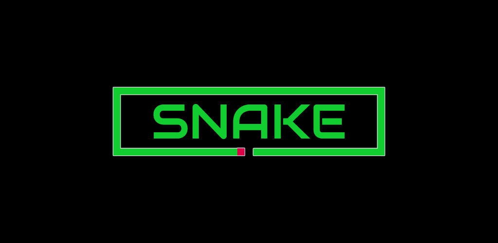

# Classical Snake Game with Obstacles

This project is a modern take on the classic Snake game, featuring the traditional gameplay with an added twist - obstacles! Navigate the snake around the screen, eating food to grow larger while avoiding walls and randomly placed obstacles. The game challenges players to beat their high score by surviving as long as possible.

## How to Play

- Use the arrow keys to change the direction of the snake.
- Eat the red squares to grow larger and gain points.
- Avoid colliding with the walls, yourself, or the obstacles.
- The game ends when the snake hits a wall, an obstacle, or itself.

## Screenshot

## Running the Game

To run the game, simply open the `index.html` file in a modern web browser.

Enjoy the game and try to beat your high score!